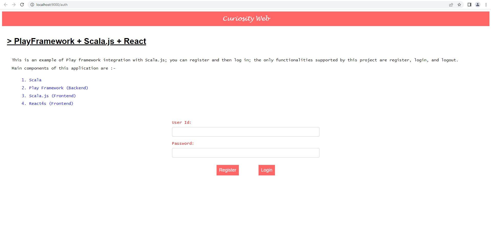
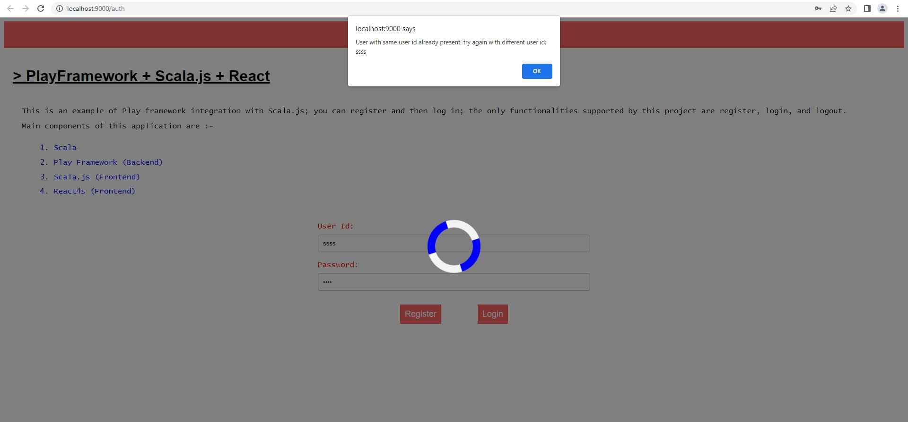
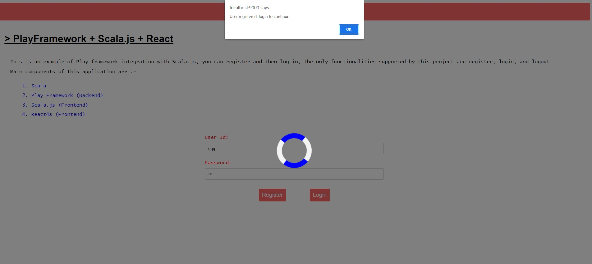
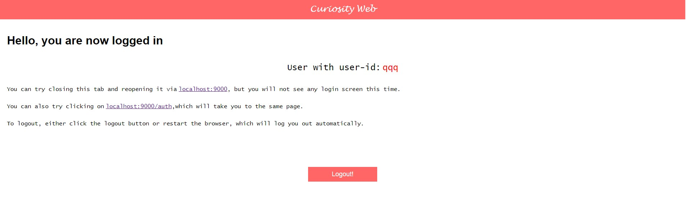

# play-scalajs-react-sample

This is a proof-of-concept for integrating the Play framework backend with Scala.js and React frontend.

## How to run?

To run this project:-

    sbt "project server" run

And then browse the url: [localhost:9000](http://localhost:9000)

## Libraries/Tools/Frameworks Used

- https://www.scala-lang.org/
- https://www.playframework.com/
- https://www.scala-js.org/
- http://www.react4s.org/
- https://reactjs.org/

## Project Images

